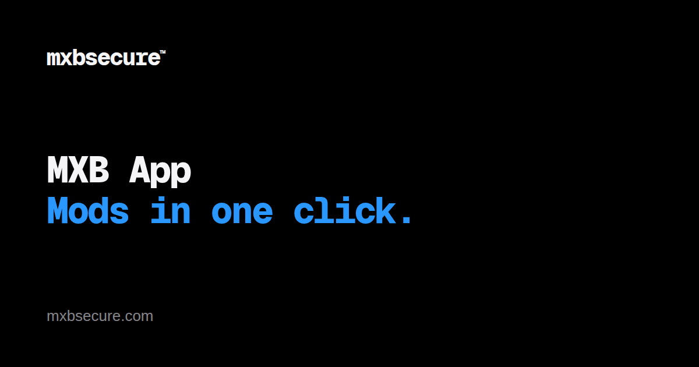

<p align="center">
  <a href="https://mxbsecure.com/app"></a>
</p>

# MXB App

**[mxbsecure.com/app](https://mxbsecure.com/app)** · [Download for Windows](https://get.mxbsecure.com/app/windows) · [Everything from mxbsecure](https://mxbsecure.com)

[](https://github.com/Frostn1/mxb-app/actions/workflows/ci.yml)
[](https://mxbsecure.com/app)
[](https://github.com/Frostn1/mxb-app/releases)
[](https://mxbsecure.com/app)
[](https://github.com/Frostn1/mxb-app)
[](LICENSE)
[](#download)
[](https://mxbsecure.com)

**MXB App** is a desktop mod manager for [MX Bikes](https://mx-bikes.com/). It
replaces the tedious manual install dance — open mxb-mods.com, follow the link,
download from MediaFire, unzip, and move files into the right folder — with a
single flow:

> **Search a mod → open its page → click _Add to Library_ → done.**

MXB App downloads the mod, extracts it, and drops the files into the matching MX
Bikes `mods` folder automatically.

Tracks, bikes, rider gear, paints, sounds, model swaps and riding-style
animations are all recognised — and anything can be installed by dropping it on
the window, sorted by what the archive holds rather than by what its title says.

[GP Bikes](https://gp-bikes.com/) is a second title in the same app, switched from
the sidebar. Installing, the library and presets all work there.
What doesn't is per-title and gated on a capability rather than hidden: the 3D
previews need part bindings GP Bikes hasn't got yet, and the stores and Race mode
sell and manage MX Bikes content, so those rows don't appear. The UI speaks six
languages (Settings → Appearance).

## Download

Get it from **[mxbsecure.com/app](https://mxbsecure.com/app)**, or straight from the
[Releases](https://github.com/Frostn1/mxb-app/releases) page:

- **Windows**: [`.exe` installer](https://get.mxbsecure.com/app/windows) (recommended; MX
  Bikes runs on Windows).
- **macOS** (Apple Silicon): [`.dmg`](https://get.mxbsecure.com/app/mac). Play launches the
  game through a CrossOver, Whisky or Wine bottle.
- **Linux**: [`.AppImage`](https://get.mxbsecure.com/app/linux),
  [`.deb`](https://get.mxbsecure.com/app/deb) and [`.rpm`](https://get.mxbsecure.com/app/rpm),
  for playing under Proton (SteamOS included).

### More from mxbsecure

- **[MXB Coach](https://mxbsecure.com/coach)**: reviews your laps, sets up your bike and calls
  cues while you ride.
- **[Frost's Studio](https://mxbsecure.com/studio)**: paints, tracks and the Designer.
- **[FrostMod](https://mxbsecure.com/frostmod)**: the in-game companion.
- **[Replay Mod](https://mxbsecure.com/replay)**: cameras and cuts for replays.

Builds are unsigned, so Windows SmartScreen / macOS Gatekeeper will warn on
first launch — choose _Run anyway_ / right-click _Open_.

You only install once: the app checks for new releases on launch (and every 6
hours), then downloads and installs them on restart.

## What's in it

Each of these is a tab in the app.

- **Browse** — the catalog, from [mxb-mods.com](https://mxb-mods.com) via its
  public WordPress REST API (search, listings, images), behind a swappable
  `ModSource` trait in the Rust backend. GP Bikes browses its own site.
- **Shop** and **MXB Hub** — the two paid storefronts,
  [mxbikes-shop.com](https://mxbikes-shop.com) and
  [shop.mxb-hub.com](https://shop.mxb-hub.com). Both sign in with the user's own
  account and install what it already owns, free items included; buying still
  happens on the store's own site. See [below](#the-shop-catalog-credential) for
  the one half of Shop that needs a build-time credential.
- **Library**, with **Downloads** under it — what's installed, and what arrived
  (or failed to) recently.
- **Locker** — swap each bike's model and engine sound between the sets you have
  installed, with the 3D preview beside it.
- **Presets** — save a full rider look and load it onto a bike on command.
- **Servers** — every MX Bikes server, live, with the track's picture even when you
  don't have it. On a server running a free track you're missing, **Install & join**
  installs it and joins, or puts you in line when the server is full. When the list
  won't load it says whether that is MX Bikes' own master server or something at your
  end, rather than showing a bare error — see "Is MX Bikes down, or is it you?" below.
- **Studio** — opens [Frost's Studio](https://mxbsecure.com/studio), or gets it for
  you. The Designer, the Paint, Track and Rider studios and content locking are all
  there now, in their own app ([`apps/studio`](apps/studio/)). Both apps read the same
  folders, so nothing moves.
- **Race mode** — MX Bikes loads every mod in the folder at startup, so a preset
  names the track it races on and everything else steps aside into a holding
  folder until you bring it back.
- **Settings** — the game path, appearance and language, FrostMod (including its
  replay-camera key bindings and camera paths), paint sync, plugins, and
  Supporters.

Running through all of it:

- **Paint sync.** MX Bikes transmits no custom content, so a grid of strangers is
  a grid of default liveries. The app publishes what your rider is wearing and
  pulls back what everyone else published, on any server — it reads the server's
  name out of the running game, so a public server syncs like a private one and
  the host installs nothing. Content-addressed by SHA-256, so twenty riders
  sharing a paint is one stored object. Off by default; Settings → General turns
  it on, and Settings → Paint sync shows what it published and pulled.
- **Is MX Bikes down, or is it you?** The game answers a dead master server with
  `connection timeout` and nothing else — the identical string it prints for a firewall
  rule, a broken DNS server or a router that wants restarting. So the commonest failure
  in the game is the one failure it gives you no way to place, and it reaches the Discord
  as several people each debugging a machine that is working perfectly. A failed server
  list now asks how many *other* apps failed the same fetch in the last ten minutes and
  leads with that, because one machine failing proves nothing and twenty proves a great
  deal. **Check my connection** then walks outwards from the machine — internet, whether
  the master's address resolves, whether outbound UDP is being blocked, our own fetch —
  and finishes with what everyone else is seeing, the only check that can overturn the
  rest. Each app contributes one anonymous bit and one word for why, on the same setting
  the usage counters use; the same numbers are public at
  [mxbsecure.com/status](https://mxbsecure.com/status), which is a link a Discord bot can
  post instead of a troubleshooting list.
- **A shared server book.** The Servers tab has always rebuilt its whole list with `GETINFO`
  when the master won't answer — a server answers that to anyone, with no account and no
  ticket — but only from addresses this install had already been told about, so on a fresh
  install the fallback had nothing to fall back to. That is exactly who an outage hits
  hardest. The app now contributes the addresses it sees to a pooled book and seeds its own
  from it, so the fallback is in place before the outage rather than after. Addresses only,
  no names and no install id; the control plane holds one back until distinct networks have
  independently seen it in the game's own list, because a list that tells thousands of apps
  where to send a datagram cannot take anybody's word for it.
- **Live reload.** A debounced watcher on `<modsPath>/mods` signals FrostMod to
  reload the game when mods are added — including ones installed outside the app.
  Off Windows that means the game's own Wine prefix — Proton's
  `steamapps/compatdata/<appid>` on Linux, your CrossOver/Whisky bottle on macOS.
  FrostMod is a Windows program and so is the game it injects into, so the app
  starts it in there rather than beside itself, and reaches it with a command file
  instead of a Windows event (nothing outside a Wine prefix can pulse one). Needs
  FrostMod v0.13.0 or newer, which is what reads that file; GP Bikes needs
  v0.11.0.
- **Plugins.** Paid add-ons load at runtime and contribute their own nav rows. A
  license is an Ed25519-signed statement the app checks locally, so a plugin keeps
  working offline for a week between checks.
- **Downloads** are resolved per host — MediaFire and Google Drive (folder links
  included), MEGA single-file links fetched and decrypted, everything else taken
  as a direct link. MEGA *folder* links and Proton Drive shares are the
  exceptions: both are told to download by hand and install with _Choose file_.
- **Archives**: `.zip`, `.7z` and `.rar` are extracted natively; already-packaged
  `.pkz` / `.pnt` files are placed as-is.
- **Self-update**: `tauri-plugin-updater` against the `latest.json` published with
  each release; signature-verified, installs on restart.
- **Supporters**: Settings → Supporters credits the people who bought a coffee on
  [Buy Me a Coffee](https://buymeacoffee.com/). The names come from
  [`supporters.json`](supporters.json) on `main`, fetched at runtime and cached —
  adding somebody there reaches installed copies without a release, and an offline
  launch still shows the last list it saw.

## Tech stack

- [Tauri 2](https://tauri.app/) (Rust backend)
- [React 18](https://react.dev/) + [TypeScript](https://www.typescriptlang.org/)
  + [Vite](https://vitejs.dev/)
- [Tailwind CSS](https://tailwindcss.com/) + [shadcn/ui](https://ui.shadcn.com/)
  (Radix primitives) for UI, [lucide](https://lucide.dev/) icons,
  [Sonner](https://sonner.emilkowal.ski/) toasts, and
  [Swiper](https://swiperjs.com/) for galleries
- [three.js](https://threejs.org/) via
  [React Three Fiber](https://r3f.docs.pmnd.rs/) + drei for the 3D rider, bike
  and track previews

## Repo layout

| Path | What it is |
| --- | --- |
| [`apps/manager/`](apps/manager/) | **MXB App** — browse, install, manage, launch. React frontend, Rust backend. |
| [`apps/studio/`](apps/studio/) | **Frost's Studio** — the paint Designer, Paint Studio, Track Studio and the rider rig. Ships from [`Frostn1/frost-studio`](https://github.com/Frostn1/frost-studio). |
| [`crates/core/`](crates/core/) | Shared Rust: the game's own file formats, and the model pipeline both apps draw with. |
| [`packages/shared/`](packages/shared/) | Shared TypeScript: the 3D viewer, the UI primitives, the API client and the base dictionary. |
| [`control-plane/`](control-plane/) | The Cloudflare Worker paint sync, plugin licensing and server registration talk to. |
| [`server-agent/`](server-agent/) | The Rust agent that runs on a dedicated-server box. |
| [`scripts/`](scripts/) | Release plumbing — changelog sections, Discord notes, the Linux AppImage fix-up. |
| [`site/`](site/) | The landing page published by [`pages.yml`](.github/workflows/pages.yml). |

The repo is a bun + Cargo workspace holding two applications. They share one copy of the
file-format and 3D code (`crates/core`, `packages/shared`) and one config folder, so a bike
the Studio paints is a bike the manager already knows about.

`server-agent/` is deliberately outside the Cargo workspace: it needs its own release
profile, which a workspace member cannot have.

## Development

Prerequisites: [Node.js](https://nodejs.org/) 20+ (CI builds on 20; the
control-plane Worker needs 22) and the
[Rust toolchain](https://www.rust-lang.org/tools/install), plus the
[Tauri system dependencies](https://tauri.app/start/prerequisites/) for your OS.
On Linux that includes `libasound2-dev` — see
[`ci.yml`](.github/workflows/ci.yml) for the full apt list.

```sh
bun install          # install frontend dependencies
bun run tauri dev    # run the desktop app (Vite + Rust)
```

Other scripts:

```sh
bun run dev          # Vite dev server only (frontend; Tauri commands unavailable)
bun run build        # typecheck + build the frontend
bun run typecheck    # tsc --noEmit
bun run lint         # eslint
bun run tauri build  # produce a production desktop bundle
```

Rust backend (from the repo root — it is the Cargo workspace root):

```sh
cargo check --workspace   # typecheck the Rust
cargo test --workspace    # unit tests — catalog parsing, download resolution, install
                     # routing, the game's file formats. Tests needing a real MX
                     # Bikes asset are #[ignore]d.
```

[`ci.yml`](.github/workflows/ci.yml) runs on every push to `main` and every PR:
the frontend typecheck/lint/build, `cargo test` on Linux *and* Windows, the
control plane, the server agent, and a PowerShell parse of the generated
server-bootstrap scripts.

> MX Bikes is a Windows game, so a real install is a Windows one — but the app
> launches it on macOS through a CrossOver, Whisky or Wine bottle, and on Linux
> under Proton. The cross-platform logic builds and tests on any OS.

### Optional modules

Secure content (the **Secure** tab) comes from a local-only module that is not in
the public tree; content locking lives in Frost's Studio now. Its absence is the
normal case — [`build.rs`](apps/manager/src-tauri/build.rs) sets a `cfg` when the file
is present, and without it the app simply doesn't show that row.
A fork builds and runs with everything else intact.

### The shop catalog credential

The **Shop** tab has two halves. **My purchases** signs in to
[mxbikes-shop.com](https://mxbikes-shop.com) with the user's own account and installs what
they have already bought — it needs no build-time credential. **Catalog** browses the store's
public listing, and that half needs an API credential supplied by the store. Copy the example
file and fill it in:

```sh
cp .env.local.example .env.local   # gitignored; never commit it
```

The store authenticates with a single custom header, so `MXB_SHOP_API_HEADER` is the header's
*name* and `MXB_SHOP_API_KEY` is its value.

`apps/manager/src-tauri/build.rs` reads the file at compile time and bakes the values into the Rust binary
— they are deliberately not Vite env vars, which get inlined into the JS bundle and would
ship the key to anyone who unzips the app. Setting the same names in the environment
overrides the file, which is how CI supplies them.

**Building without it is fully supported**: the Catalog tab simply doesn't appear, the Shop
opens straight on My purchases, and nothing else changes. That's what forks build. Official
releases get the values from the `MXB_SHOP_API_HEADER` and `MXB_SHOP_API_KEY` repository
secrets — **without those secrets, released builds ship with no catalog.**

The catalog is browse-only: it shows what the store sells and links out to the product page.
Buying happens on the store's own site. Installing something already bought goes through My
purchases, which downloads the file and hands it to the same review sheet a drag-and-drop
uses, so it lands by what the archive contains rather than by what its title suggests.
MXB Hub works the same way and needs no credential at all — its catalog is a public
WooCommerce Store API.

## Releases

Releases are built in CI by
[`.github/workflows/release.yml`](.github/workflows/release.yml) — it compiles
Windows, macOS and Linux bundles and attaches them to a GitHub Release.

Write the version's `CHANGELOG.md` section **before** tagging. The release body
and the Discord announcement are both composed from it by
[`scripts/changelog-section.sh`](scripts/changelog-section.sh), which finds a
section by the `v<version>` in its heading — so work still sitting under an
"Unreleased" heading ships notes that never mention it.

Then make sure `apps/manager/package.json`, `apps/manager/src-tauri/tauri.conf.json`
and `apps/manager/src-tauri/Cargo.toml` all carry the version, and push a matching tag:

```sh
git tag -a v0.13.0 -m "v0.13.0 — what it's called"
git push origin v0.13.0
```

A **suffixed** tag — `v0.13.0-beta.3`, `v0.13.0-rc.2` — builds the same three
platforms but publishes as a **pre-release**: GitHub keeps it off
`releases/latest`, which is the endpoint the in-app updater reads, so existing
installs are never offered it, and it's announced in the beta Discord channel
rather than the release one. Tagging the plain `v0.13.0` afterwards is what ships
it to everyone. The workflow decides both of those purely from the `-` in the tag,
so neither is set by hand.

The workflow **publishes** the release with the installers attached
(`releaseDraft: false`), renames the bundles to `MXB-App-<ver>-<arch>.<ext>` and
patches `latest.json` so self-update keeps verifying.

The Linux build takes one detour on the way: it goes through
[`scripts/tauri-build.sh`](scripts/tauri-build.sh), which runs the same `tauri build` the
other platforms do and then takes the bundled libwayland back out of the AppImage and signs
it again — [`scripts/appimage-drop-bundled-wayland.sh`](scripts/appimage-drop-bundled-wayland.sh)
says why, and needs only `squashfs-tools`. It works on an AppImage that has already been
downloaded too, which is how to hand a Linux tester a fixed build without cutting a tag:

```sh
scripts/appimage-drop-bundled-wayland.sh MXB-App-0.13.0-amd64.AppImage
```

A tag can also be created from the GitHub web UI — **Releases → Draft a new
release → Create new tag on publish** — which is the way to cut one without a
terminal. **Actions → Release → Run workflow** is *not*: a `workflow_dispatch`
build tags itself `v<run number>`, leaves the running app without its version, and
skips the announcement. It's for testing that a build compiles, not for shipping.

## Roadmap

Features coming next:

- **A 3D preview for GP Bikes.** Locker's preview needs part bindings GP Bikes
  hasn't got yet, so it says so plainly rather than showing an empty stage.
  Frost's Studio has the same gap for its paint preview.
- **Hosting a server from the app.** Built once and taken back out — creating and
  running a dedicated server needs an account on the control plane, and opening
  that up is the remaining work.
